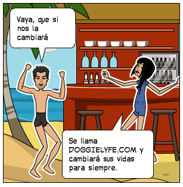

# Red Social

## SOBRE EL PRODUCTO

Instagram, Snapchat, Twitter, Facebook, Twitch, Linkedin, las redes sociales han invadido nuestra vida. Las amamos, odiamos, idolatramos y muchos no podemos vivir sin ellas. Dado este contexto, un emprendedor muy visionario nos ha encargado crear una red social. No nos da mucho detalle sobre qué tipo de red social quiere, él solo nos dice que creemos la que mejor podamos y que luego lo convenzamos de que nuestra red social será la más exitosa.

Para él hay algunos puntos básicos que debe tener una red social:

Perfiles de usuarios
Un newsfeed donde puedes ver las actualizaciones de todos tus contactos
Un lugar donde poder escribir posts
Un lugar para subir fotos
Capacidad para poder tener amigos o para poder seguir a personas/marcas dentro de la red social
Ser mobile friendly
Este emprendedor, además, sabe que los creadores de productos tienen que pensar siempre en los usuarios y espera que tengas en cuenta lo que necesitan los usuarios al momento de crear este producto, si piensas por ejemplo en una red social para compartir memes, o una para compartir cosas de mascotas o alguna otra para compartir tips sobre restaurantes o recetas, tendrás que tener en cuenta qué es lo que le gustaría encontrar a un usuario sobre estos temas en la red social.

Un ejemplo: a este emprendedor le presentaron un caso de una red social para químicos. En esta red social los químicos postean artículos sobre sus investigaciones y pueden encontrar el contenido de acuerdo a lo más popular, lo reciente o lo más comentado. Además, pueden comentar en los artículos de sus colegas y pueden filtrar artículos de acuerdo a determinadas etiquetas.

¿QUÉ SE REQUIERE?
Trabajar en parejas
Tener una planificación
La definición del diseño
Diseño mobile friendly
Desplegar el producto en Github Pages
Opcional, si se desarrolla un login o se desea almacenar la información en una base de datos, usar Firebase.

***

## Problematica

> Un emprendedor muy visionario nos ha encargado crear una red social. No nos da mucho detalle sobre qué tipo de red social quiere, él solo nos dice que creemos la que mejor podamos y que luego lo convenzamos de que nuestra red social será la más exitosa.

***

## Lluvia de ideas

* Red social de perros,
* Hoteles para perros,
* Guarderías para perros,
* Cuidado de perros,
* Comunicar amantes de perros,
* Compartir dia a dia de sus mascotas,
* Noticias,
* Cómo cuidar a nuestras mascotas,
* Recomendaciones de otros usuarios,
* Labor social de guarderías,
* Adoptar y encontrar lugares de adopcion.

***

## Hipótesis de la lluvia de ideas

> Se decidió realizar una red social de Perro, para poder compartir, el dia a dia de nuestras mascotas, donde se pueden ver recomendaciones de otros usuarios, así como tips de como adiestrar, donde poder llevarlos a divertirse y también encontrar Hoteles, guarderías, lugares de adopción, así como dar una labor social para ayudar a perros en condición de calle, o en mal estado. Todo para que nuestro mejor amigo viva al máximo y que nuestros amigos vean a nuestro querido compañero en su dia a dia.

***

## Encuestas

> Se realizaron 31 encuestas

### Preguntas

***

## Hipótesis de las entrevistas

> Después de realizar las encuestas se determino que la mayoria de personas quieren una red social para sus mascotas, los que marcaron no, el motivo principal es que no tienen una mascota, de los encuestados solo 4 dijeron conocer una red social de perros.

>Lo que más buscan sobre perros es como educar a mi perro, así como los encuestados dijeron que buscan todo sobre como cuidar a sus mascotas, entre otros que quieren ver imagenes graciosas, se les preguntó sobre la paleta de colores a utilizar se escogió la número 3.

### Conclusión:

> Se determinó que si es factible una red social de perros, la cual informe sobre cómo cuidar a tu perro, puedas compartir, lugares pet friendly, en general como cuidar, alimentar y pasear con tu perro, lo mejor es crear una página con colores más cálidos y alegres, y que puedas compartir todo lo relacionado a al dia cotidiano de tu perro.

***

## Resultados y Criterios de aceptación

* Interfaz amigable
* Interfaz fácil de entender
* Perfiles personales
* Muestre noticias
* Muestre las publicaciones de tus amigos
* Seguir personas
* Lugar para fotos
* Lugar para poder postear

***

## Propuesta 

### RED SOCIAL DE MASCOTAS

> Nombre: Doggy Life.

> Doggy Life, es una red social donde que permitir al usuario amante de los perros buscar y conocer cosas y sitios para compartir y llevar a sus mascotas ya que forman parte fundamental de nuestras vidas y poco a poco los queremos ir involucrando más en nuestras actividades diarias.
Para ello los usuarios darán a conocer que lugares en Jalisco son Pet Friendly, así como también que lugares son seguros y confiables para su estancia, por medio de recomendaciones de otros usuarios.

>La idea de este sitio es dar a conocer los siguientes aspectos o actividades con beneficio para ellos ejemplo:

* Guarderías para perros,
* Veterinarias,
* Estéticas,
* Sitios donde poder salir a pasear con ellos sin problema alguno,
* Tiendas,
* Por el momento solo es para Jalisco,
* Además si tu y tu mascota son muy aventureros hay una sección muy especial para ti: Esta sección muestra destinos turísticos donde puedes pasar gratos momentos juntos totalmente Pet Friendly,
* Recomendaciones de otros amantes de perros,
* Tips para cuidar o adiestrar a tu perro.

> Por otro lado esta red también hará su labor social y altruista al dar a conocer cuales son los albergues de perros sin hogar a los cuales podemos a cuidar para adoptar a nuestro mejor amigo y compañero de por vida.

> Esta red como parte de su labor social no promueve la compra de animales, más bien, está a favor de la adopción y en darle una mejor vida a ese amigo especial que espera por ti.

***

## Historia de el usuario

>El es daniel es un amante de los perros, los considera los mejores acompañantes, es programador, y disfruta de viajar, siempre que viaja tiene el mismo problema donde dejar a su amado Betho.      

>Así como no sabe a quién recurrir cuando quiere saber algo sobre mascotas, o algo tan simple como publicar el dia a dia de su amado Betho y compartirlo con sus amigos, existen otras redes sociales que hacen algo similar, pero el necesita un solo lugar donde pueda encontrar todo al respecto de su amado Betho.

***

## Sketching 

***

## Prototyping

## Inicio

***
## Marketplace

***
## Perfil y seguir

***
### Servidor

link de el servidor Doggie-Life [https://doggie-1ead6.firebaseapp.com/].

***

## Herramientas utilizadas

* Html 5
* Css 3
* Js
* Bootstrap 4
* jQuery
* Firebase

***

## Creado por

* Lillys hernandez ramos

* Maria Elizabeth Vera Meza

***